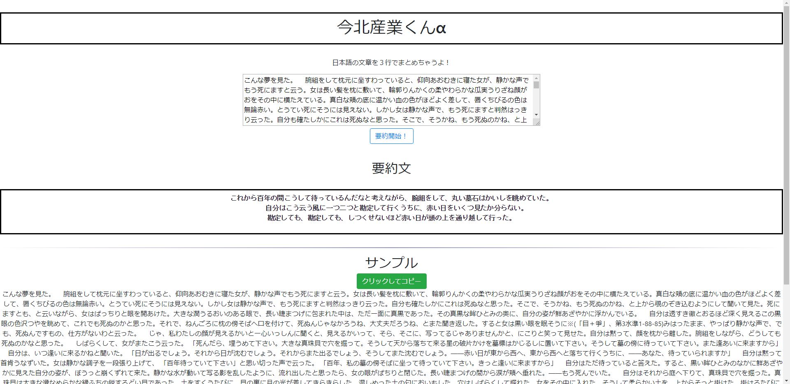

# README

入力したテキストを3行の文章に要約するWEBアプリを起動します。

This system summarizes input text into 3 sentences.

## How to run

- `cd mydirectory`
- `git clone git@github.com:akihiros/nlp-summarization.git`

- `python run.py`

起動後`http://127.0.0.1:5000`にアクセスしてください。

## Reference

[reference](reference.md)